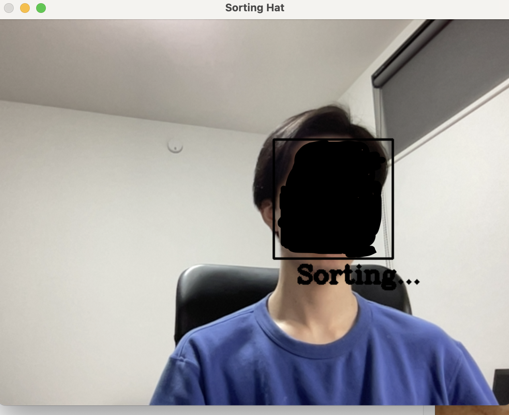
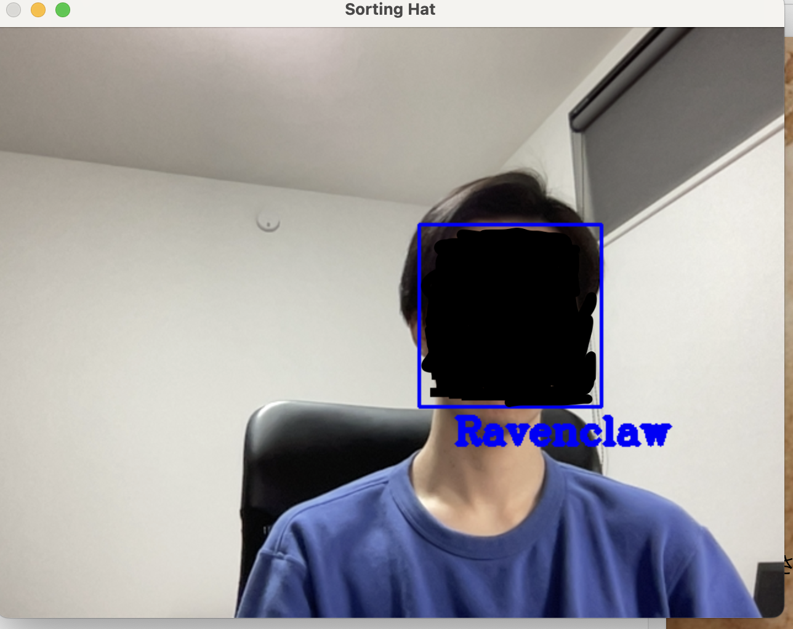

# Sorting Hat
<p align="center">
  
</p>
<p align="center">
  Sorting Hat
</p>

This repository contains an implementation of the Sorting Hat in Harry Potter.
A CNN-based model classifies a face image into one of the four Hogwarts houses.

## Training the model
You can use `image_icrawler.py` to gather images and train a model using `sortinghat.ipynb`.

### Download pretrained model
You can download the pretrained model [here](https://drive.google.com/uc?export=download&id=19l8xuZchP24kNgS4jkmC1i--IHime1f7)


## Run Sorting Hat on an Image
Use sortinghat.py to sort an image.
To run it,
```bash
python sortinghat.py \
    --indir /path/to/image \
    --outdir /path/to/output/directory \
    --model /path/to/model \
```
This will:
- Detect faces in the input image
- Predict the Hogwarts house for each face
- Save an annotated result image in the specified output directory

## Run Sorting Hat in Real Time
Use sortinghat_camera.py to sort from camera.
```bash
python sortinghat.py \
    --model /path/to/model \
```
This will
- Access your default webcam
- Detect and classify faces in real time
- Display a live window with results

## Sorting Hat Demo
<p align="center">
  
</p>
<p align="center">
  The system detects the user’s face in real time and displays a ‘Sorting…’ message while processing.
</p>

<p align="center">
  
</p>
<p align="center">
  After processing, the system displays the assigned house (e.g., ‘Ravenclaw’) on the screen along with the detected face.
</p>